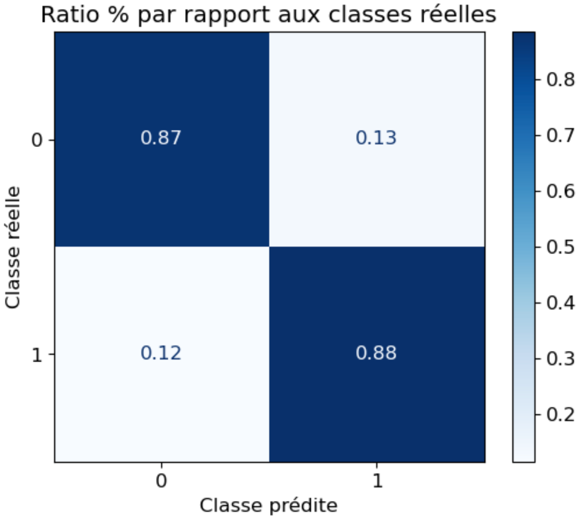
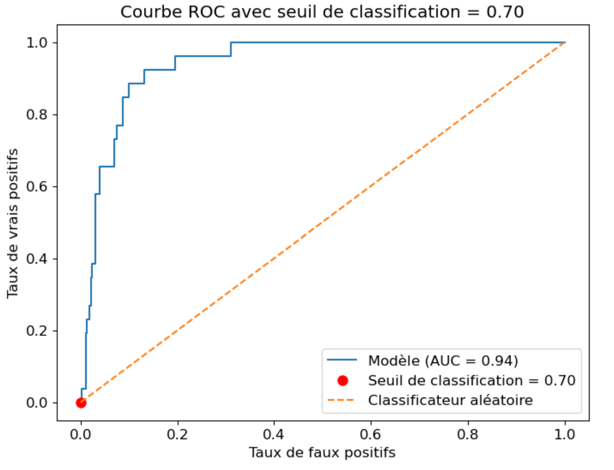
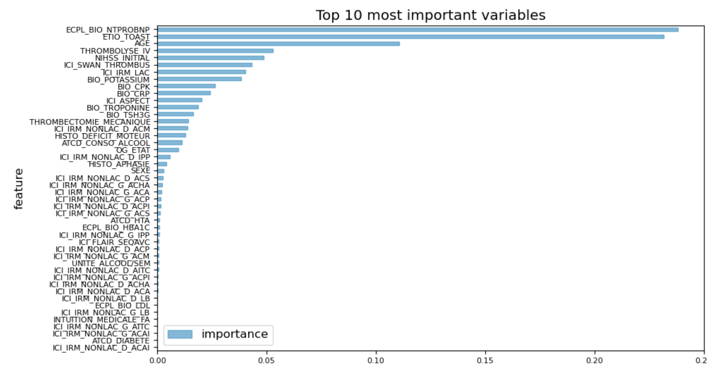

# Leveraging Machine Learning for Early Detection of Atrial Fibrillation as a Stroke Risk Factor

**Note:** Due to time constraints, we were unable to organize and document the project comprehensively. We apologize for any shortcomings, but this project is intended to give you an idea that could be further developed and refined properly. It is not a production-ready solution, as the competition involved 48 hours of non-stop coding to simply demonstrate the feasibility of this proof-of-concept (PoC).

## Abstract:
Stroke is one of the leading causes of mortality and long-term disability worldwide. Atrial fibrillation (AF) is a common underlying condition contributing to ischemic stroke, yet it often remains undiagnosed until after a cerebrovascular event. This POC presents a machine learning-based approach to identify patients with a high likelihood of undiagnosed atrial fibrillation, using demographic, clinical, and historical health data. Developed as part of the D4GEN 2023 Hackathon organized by Genopole, the proposed model aims to empower clinicians with a predictive tool to enable earlier detection and intervention, ultimately improving patient outcomes and reducing stroke incidence. This project, which won the second prize in the competition, is a proof-of-concept (PoC) presented at the Clinical Research Office of the Hôpital Sud Francilien.

---

## Introduction:
Stroke is a major global health concern, accounting for significant morbidity and mortality. Early identification and management of risk factors are essential to mitigating stroke incidence. Among these factors, atrial fibrillation is particularly concerning due to its asymptomatic nature in many patients. Traditional diagnostic methods often fail to detect subclinical atrial fibrillation before a stroke occurs, highlighting an urgent need for predictive tools that can facilitate earlier diagnosis.

Machine learning offer promising avenues for addressing this gap. By analyzing large-scale medical datasets, it can identify subtle patterns and correlations between patient characteristics and underlying conditions. This study proposes a machine learning-based model to predict patients at high risk of atrial fibrillation, thus providing clinicians with actionable insights to target interventions more effectively.

---

## Problem Statement:
The asymptomatic nature of atrial fibrillation poses a significant challenge in preventing stroke. Current diagnostic methods, such as electrocardiography or long-term monitoring, are resource-intensive and often applied only after a stroke occurs. This reactive approach delays treatment and increases the risk of recurrent strokes. Furthermore, atrial fibrillation often coexists with other cardiovascular risk factors, complicating diagnosis in patients with multifactorial stroke etiologies.

To address these limitations, this project seeks to answer the following questions:

1. Can machine learning algorithms reliably predict the presence of atrial fibrillation in patients based on readily available medical data?

2. What patient-specific factors most strongly correlate with atrial fibrillation as a stroke precursor?

---

## Methods:
The proposed solution leverages some machine learning techniques to analyze medical datasets, including demographic attributes (age, sex), clinical metrics, and medical history. The workflow includes:

1. Data Preprocessing: Cleaning and normalizing patient data to ensure consistency and minimize biases.

2. Feature Selection: Identifying the most relevant variables, such as comorbidities (e.g., hypertension, diabetes), heart rate variability, and stroke history.

3. Model Training and Validation: Training supervised machine learning models, to classify patients based on their likelihood of atrial fibrillation.

4. Interpretability: Employing explainable AI techniques to provide clinicians with insights into the factors influencing model predictions.

---

## Results and Discussion:

Using a Random Forest algorithm, we achieved promising results in predicting the likelihood of atrial fibrillation among patients. The importance of various features was evaluated, and the most influential predictors included age, biomarkers, and clinical history. A visualization of the feature importance from the model is shown below.

While the Random Forest model demonstrated good predictive performance, the training dataset used in this study was relatively small, which likely constrained the model’s overall accuracy, generalizability and robustness, necessitating further validation on larger datasets. With additional data, particularly from diverse patient populations and more extensive clinical records, the model's performance could be significantly improved. 

---

## Conclusion:

This study highlights the utility of machine learning in addressing the diagnostic challenges associated with atrial fibrillation as a stroke risk factor. By providing an early warning system, the proposed model can help clinicians diagnose atrial fibrillation more efficiently, facilitating timely interventions and improving patient outcomes. The project exemplifies the transformative role of data science in personalized medicine and underscores the importance of multidisciplinary collaboration in tackling complex healthcare challenges.

It is important to note that this project is currently a proof-of-concept (PoC), which demonstrates feasibility but underscores the need for ongoing research to refine and validate the approach. It was presented at the Clinical Research Office of the Hôpital Sud Francilien. Further research and clinical testing are necessary before broader implementation.

---

## Acknowledgments:
We extend our gratitude to the D4GEN 2023 Hackathon organizers and participants, including data scientists, cardiologists, neurologists, developers, and mathematicians, whose expertise contributed to the success of this initiative. The contributors to this project include:

- Hakim SAGHIR - Data Scientist
- Dr. Mohanad MAHFOUD - Cardiologist
- Dr. Nicolas CHAUSSON - Neurologist
- Dr. Yann L'Hermitte - Neurologist
- Thibault ELLONG - Developer
- Djebar HAMMOUCHE - Mathematician
